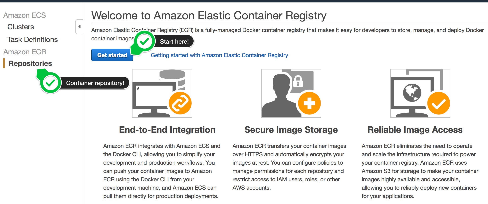
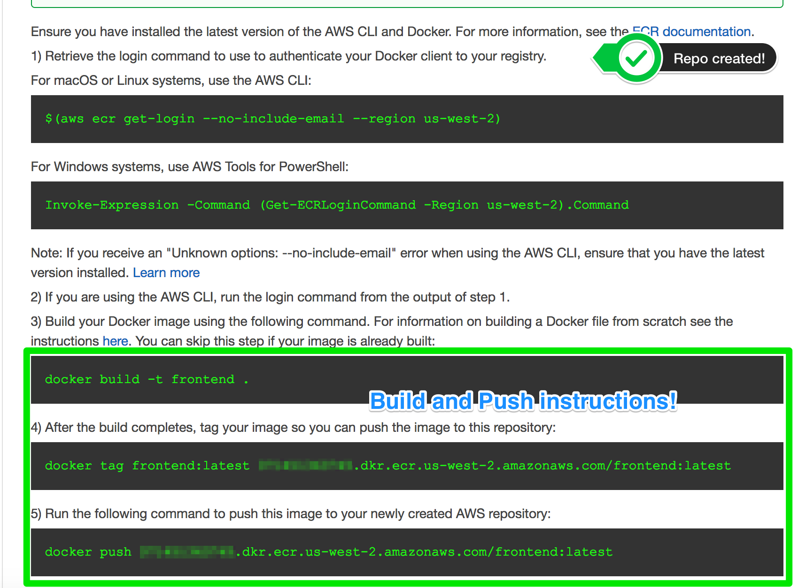

# Container Repositories

For every service that you want to modify you need to create a container repository which will host the modified container image. The two recommended options to host these images are **Docker Hub** or **Amazon Elastic Container Registry (ECR)**. ECR will allow you to keep your repositories private by default, whereas for Docker Hub private repositories one has to buy a monthly plan.

### Docker Hub
Create an account on Docker Cloud so you can rebuild the container images and push them up to the registry. Your EKS cluster is able to pull these images from public Docker Hub repositories.

### Amazon Elastic Container Registry
Create repositories in the **Amazon Elastic Container Registry (ECR)** inside your AWS account. Follow the steps shown after creating each repository to build and push a container image to the repository. In the **AWS Console** switch to *Amazon ECS* to get to **ECR**

Then create a repository for each microservice. Provide a **Name** to create the repository. The **Repository URI** where Kubernetes will pull the container images from is shown as well.

After the repository is created you will see instructions on how to access the repository and how to build and push a container image to the repository.

We recommend creating a separate **ECR repository** for *each* microservice.